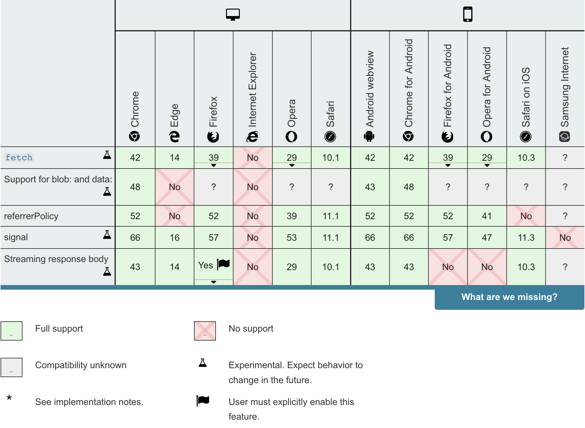

# Asynchronous Programming & Promises

## Synchronous & Asynchronous Programming

**Synchronous programs** run in sequence without blocking.

**Asynchronous programs** divert blocking to event handlers.

## Why Asynchronous Programming Matters

**User Interfaces** and **browsers** handle events asynchronously.

**Asynchronous programming** underlies database, server and api interactions.

## Asynchronous Programming in ES6

Can handle programs that take time to complete with **promises**.

**Promises** handle asynchronous functions in es6.

**Promises** exist in three states: **Pending, Fulfilled, & Rejected**.

Simulate `resolve`:

``` javascript
let p = new Promise((resolve, reject) => {
  resolve('Resolved promise data');
});

p.then(response => console.log(response));
```

The console logs this:

``` javascript
Resolved promise data
```

Simulate `reject`:

``` javascript
let p = new Promise((resolve, reject) => {
  reject('Rejected promise data');
});

p.then(response => console.log(response))
 .catch(error => console.log(error));
```

The console logs this:

``` javascript
Rejected promise data
```

Simulate what might happen when interacting with apis and networks:

``` javascript
let p = new Promise((resolve, reject) => {
  setTimeout(() => resolve("Resolved promise data"), 3000);
});

p.then(response => console.log(response))
 .catch(error => console.log(error));

console.log("after promise consumption");
```

The console logs this:

``` javascript
after promise consumption
Resolved promise data
```

## HTTP & Fetch

### HTTP Request Methods

- **GET** - retrieves data and has no secondary effect.
- **POST** - sends data to a server to add resources.
- **HEAD, DELETE, PATCH**...

## Fetch

https://developer.mozilla.org/en-US/docs/Web/API/Fetch_API/Using_Fetch



http://jsonplaceholder.typicode.com/ great resource!!

``` javascript
const root = "http://jsonplaceholder.typicode.com/posts/1"

fetch(root, { method: "GET"})
 .then(response => console.log(response));
```

The console logs this:

``` javascript
Response {type: "cors", url: "http://jsonplaceholder.typicode.com/posts/1", status: 200, ok: true, statusText: "OK", bodyUsed: false}
```

``` javascript
const root = "http://jsonplaceholder.typicode.com/posts/1";

fetch(root, { method: "GET"})
 .then(response => response.json())
 .then(json => console.log(json));
```

The console logs this:

``` JavaScript
Object { userId: 1, id: 1, title: "sunt aut facere repellat provident occaecati excepturi optio reprehenderit", body: "quia et suscipit\nsuscipit recusandae consequuntur expedita et cum\nreprehenderit molestiae ut ut quas totam\nnostrum rerum est autem sunt rem eveniet architecto" }
```

``` javascript
let root = "https://www.googleapis.com/books/v1/volumes?q=isbn:0747532699";

fetch(root, { method: "GET"})
 .then(response => response.json())
 .then(json => console.log(json));
```

