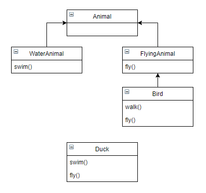
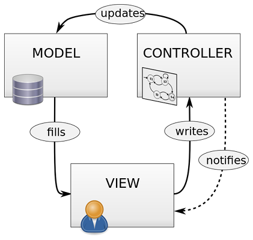

# 10 Basic Programming Principles Every Programmer Must Follow

 [Joel Lee](https://www.makeuseof.com/tag/author/joellee/)  October 26, 2017 8 minutes

Anyone can write code. But good code? That’s where it gets tough.
We’ve all heard horror stories about spaghetti code, massive if-else chains, entire programs that can break just by changing one variable, functions that look like they were obfuscated, and so on. That’s what happens when you try to make a shippable product with only a semester of programming experience under your belt.
Don’t settle for writing code that *works*. Aim to write code that can *be maintained* — not only by yourself, but by anyone else who may end up working on the software at some point in the future. To that end, here are several principles to help you clean up your act.

## 1. KISS

The **“keep it simple, stupid” principle** applies to pretty much all of life, but it’s especially necessary in medium-to-large programming projects.
It starts way in the beginning when you’re defining the scope of what you want to create. Just because you’re passionate about game development doesn’t mean you can create the next *World of Warcraft* or *Grand Theft Auto*. When you think you’ve simplified enough, simplify it one level further — feature creep is inevitable, so start small.

But even after coding has begun, keep it simple. Complex code takes longer to design and write, is more prone to bugs and errors, and is harder to modify later down the road. In the wise words of Antoine de Saint-Exupery, “Perfection is achieved, not when there is nothing more to add, but when there is nothing left to take away.”

## 2. DRY

The **“don’t repeat yourself” principle** is crucial for clean and easy-to-modify code. When writing code, you want to avoid duplication of data and duplication of logic. If you notice the same chunk of code being written over and over again, you’re breaking this principle.
The opposite of DRY code is WET code: “write everything twice” (or “waste everyone’s time”). One of the best ways to diagnose WET code is to ask yourself: in order to alter the program’s behavior in some way, how many areas of code would you need to modify?
Suppose you’re writing a podcast directory app. On the search page, you have code for fetching a podcast’s details. On the podcast page, you have code to fetch that podcast’s details. On the favorites page, the same fetching code. Consider abstracting all of that into a function so that if you need to edit it later, you can do it all in one spot.

## 3. Open/Closed

Whether you’re  [writing objects](https://www.makeuseof.com/tag/object-oriented-programming-explained/)  in Java or modules in Python, you should aim to make your code **open to extension but closed to modification**. This applies to all kinds of projects, but is especially important when releasing a library or framework meant for others to use.
 [What Is Object Oriented Programming? The Basics Explained in Layman’s Terms](https://www.makeuseof.com/tag/object-oriented-programming-explained/)   [What Is Object Oriented Programming? The Basics Explained in Layman’s Terms](https://www.makeuseof.com/tag/object-oriented-programming-explained/)  Most modern programming languages support the “object-oriented programming” (OOP) paradigm. But what exactly is OOP and why is it so useful?  [Read More](https://www.makeuseof.com/tag/object-oriented-programming-explained/)
For example, suppose you’re maintaining a GUI framework. You could release it as-is, expecting end users to directly modify and integrate your released code. But what happens when you release a major update four months later? How do they implement all of your additions without throwing away all the work they’ve done?
Instead, release code that *prevents* direct modification and *encourages* extension. This separates core behavior from modified behavior. The benefits? Greater stability (users can’t accidentally break core behavior) and greater maintainability (users only worry about extended code). The open/closed principle is  [key to making a good API](https://www.makeuseof.com/tag/api-good-technology-explained/).

## 4. Composition > Inheritance

The **“composition over inheritance” principle** states that objects with complex behaviors should do so by containing instances of objects with individual behaviors rather than inheriting a class and adding new behaviors.

Overreliance on inheritance can lead to two major issues. First, the inheritance hierarchy can become messy in the blink of an eye. Second, you have less flexibility for defining special-case behaviors, particularly when you want to implement behavior from one inheritance branch in another inheritance branch:

Composition is a lot cleaner to write, easier to maintain, and allows for near-infinite flexibility as far as what kinds of behaviors you can define. Each individual behavior is its own class, and you create complex behaviors by combining individual behaviors.

## 5. Single Responsibility

The **single responsibility principle** says that every class or module in a program should only concern itself with providing one bit of specific functionality. As Robert C. Martin puts it, “A class should have only one reason to change.”

Classes and modules often start off this way, but as you add features and new behaviors, it’s easy for them to evolve into God classes and God modules that take up hundreds, or even thousands, of lines of code. At this point, you should break them up into smaller classes and modules.

## 6. Separation of Concerns

The **separation of concerns principle** is like the single responsibility principle but on a more abstract level. In essence, a program should be designed so that it has many different non-overlapping encapsulations, and these encapsulations shouldn’t know about each other.
A well-known example of this is the model-view-controller (MVC) paradigm, which separates a program into three distinct areas: the data (“model”), the logic (“controller”), and what the end user sees (“view”). Variations of MVC are common in today’s most popular web frameworks.

Image Credit: ~[Wikimedia](https://commons.wikimedia.org/wiki/File:MVC_Diagram_(Model-View-Controller).svg)~

For example, the code that handles the loading and saving of data to a database doesn’t need to know how to render that data on the web. The rendering code may take input from the end user, but then passes that input to the logic code for processing. Each part handles itself.
This results in modular code, which makes maintenance much easier. And in the future, if you ever need to rewrite all of the rendering code, you can do so without worrying about how the data gets saved or the logic gets processed.

## 7. YAGNI

The **“you aren’t gonna need it” principle** is the idea that you should never code for functionality that you *may* need in the future. Chances are, you *won’t* need it and it will be a waste of time — and not only that, but it will needlessly increase your code’s complexity.
You could view this as a specific application of the KISS principle and a response to those who take the DRY principle too seriously. Often inexperienced programmers try to write the most abstract and generic code possible to avoid WET code, but too much abstraction ends up in bloated impossible-to-maintain code.
The trick is to apply the DRY principle only when you need to. If you notice chunks of code being written over and over, then abstract them — but never when you *think* a piece of code will be written over and over. More times than not, it won’t be.

## 8. Avoid Premature Optimization

The **no premature optimization principle** is similar to the YAGNI principle. The difference is that YAGNI addresses the tendency to *implement behaviors* before they’re necessary while this principle addresses the tendency to *speed up algorithms* before it’s necessary.
The problem with premature optimization is that you can never really know where a program’s bottlenecks will be until after the fact. You can guess, of course, and sometimes you may even be right. But more often than not, you’ll waste valuable time trying to speed up a function that isn’t as slow as you think or doesn’t get called as often as you’d expect.
Reach your milestones as simply as you can, then *profile your code* to identify true bottlenecks.

## 9. Refactor, Refactor, Refactor

One of the hardest truths to accept as an inexperienced programmer is that **code rarely comes out right the first time**. It may *feel* right when you implement that shiny new feature, but as your program grows in complexity, future features may be hindered by how you wrote that early one.

Codebases are constantly evolving. It’s completely normal to revisit, rewrite, or even redesign entire chunks of code — and not just normal, but healthy to do so. You know more about your project’s needs *now* than when you did at the *start*, and you should regularly use this newly gained knowledge to refactor old code.
Note that it doesn’t always have to be a big process. Take a page from the Boy Scouts of America, who live by these words: “Leave the campground cleaner than you found it.” If you ever need to check or modify old code, always clean it up and leave it in a better state.

## 10. Clean Code > Clever Code

Speaking of clean code, leave your ego at the door and **forget about writing clever code**. You know what I’m talking about: the kind of code that looks more like a riddle than a solution and exists solely to show off how smart you are. The truth is, nobody really cares.
One example of clever code is packing as much logic into one line as possible. Another example is exploiting a language’s intricacies to write strange but functional statements. Anything that might cause someone to say “Wait, what?” when poring over your code.
Good programmers and readable code go hand in hand. Leave comments when necessary. Adhere to style guides, whether dictated by a language (like Python) or a company (like Google). Observe per-language idioms and stop writing Java code in Python or vice versa. 

See our article on  [tips for writing cleaner code](https://www.makeuseof.com/tag/10-tips-writing-cleaner-better-code/) .
 [10 Tips for Writing Cleaner & Better Code](https://www.makeuseof.com/tag/10-tips-writing-cleaner-better-code/)   [10 Tips for Writing Cleaner & Better Code](https://www.makeuseof.com/tag/10-tips-writing-cleaner-better-code/)  Writing clean code looks easier than it actually is, but the benefits are worth it. Here’s how you can start writing cleaner code today.  [Read More](https://www.makeuseof.com/tag/10-tips-writing-cleaner-better-code/)

## What Makes a Good Programmer

Ask five people and you’ll get 10 different answers. To me, a good programmer is one who understands that coding should ultimately serve the end user, who is easy to work with in a team, and who finishes his projects to specification and on time.

If you feel stuck, see our article on  [overcoming programmer’s block](https://www.makeuseof.com/tag/5-ways-beat-programmers-block-right-now/) . And if you just aren’t happy writing code, read our article on  [signs you aren’t meant to be a programmer](https://www.makeuseof.com/tag/6-signs-meant-programmer/).

If you’re just starting out, focus on learning  [how to code without stress](https://www.makeuseof.com/tag/learn-programming-without-stress/) . Not sure which programming language to dive into first?  [C# is a good place to begin for practical reasons](https://www.makeuseof.com/tag/reasons-to-learn-csharp/) . And if you choose it, also consider these  [C programming tips](https://www.makeuseof.com/tag/c-programming-tips-to-get-started/).
