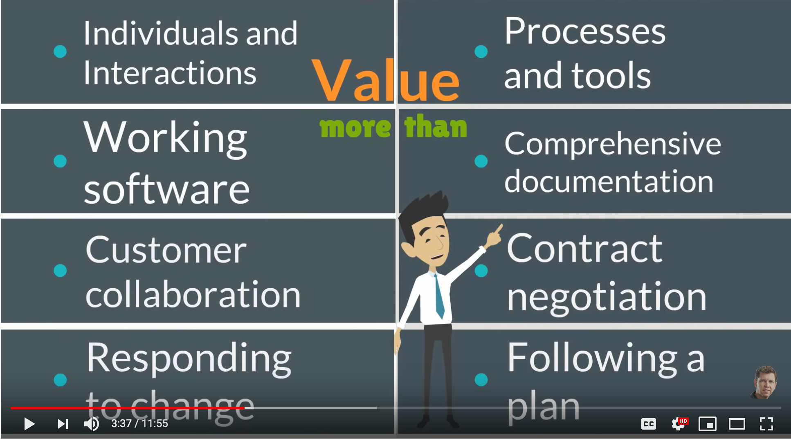

# Agile

A set of values and principles to follow in software development

It gives people a common foundation for making decisions about the best way to develop software.

* Valuing individuals and interactions over processes and tools
* Valuing working software over comprehensive documentation
* Valuing customer collaboration over contract negotiation
* Valuing responding to change over following a plan

## 12 principles support the values

1. Our highest priority is to satisfy the customer through early and continuously delivery of valuable software
2. Welcome changing requirements, even late in development.  Agile processes harness change for the customer’s competitive advantage.
3. Deliver working software frequently, from a couple of weeks to a couple of months, with a preference to the shorter timescale.
4. Business people and developers must work together daily throughout the project.
5. Build projects around motivated individuals. Give them the environment and support they need, and trust them to get the job done.
6. The most efficient and effective method of conveying information to and within a development team is face-to-face conversation.
7. Working software is the primary measure of progress.
8. Agile processes promote sustainable development. The sponsors, developers, and users should be able to maintain a constant pace indefinitely.
9. Continuous attention to technical excellence and good design enhance agility.
10. Simplicity-the art of maximizing the amount of work not done-is essential.
11. The best architectures, requirements, and designs emerge from self-organizing teams.
12. At regular intervals, the team reflects on how to become more effective, then tunes and adjusts its behavior accordingly.
