# JavaScript for React Developers

Modern Javascript Essentials

## var, let, const

If var is in a for loop, it is still accessible outside of the for loop.

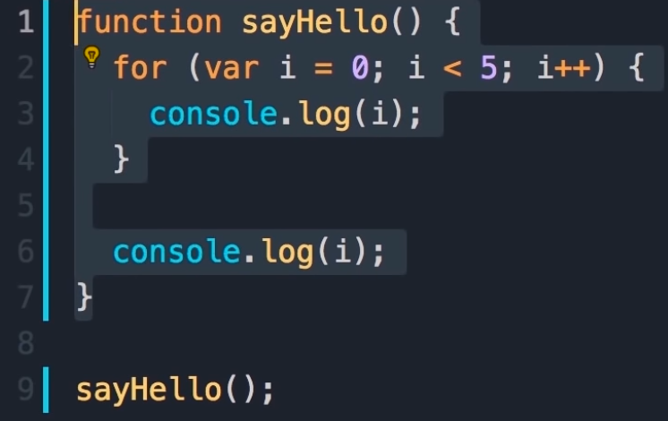

The `i` that is outside the for loop has a value `5`

Change `var` to `let` and the variable should only be accessible inside the for loop.

`var` -> scoped by the function
`let` -> scoped by the block it’s defined

`const`  -> scoped by the block it’s defined
`const` cannot be reassigned a value after it’s assigned a value

## Objects

Functions inside an object are called methods

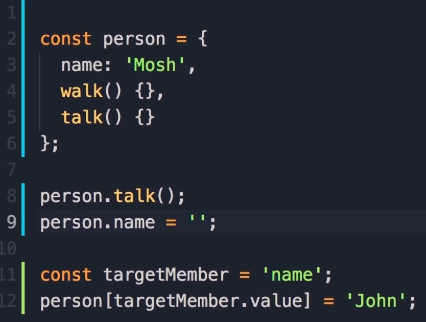

Use dot notation when you know what you are accessing in the object. Use bracket notation when you don’t know what is in the object.

## The this keyword

`this` value is determined by how a function is called. If it is called in a method of an object,  it will return a reference to that object.
`.bind()` Is an object to which this keyword can refer inside the new function
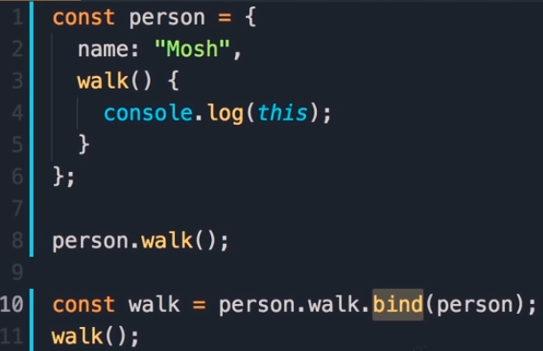

## Arrow Functions

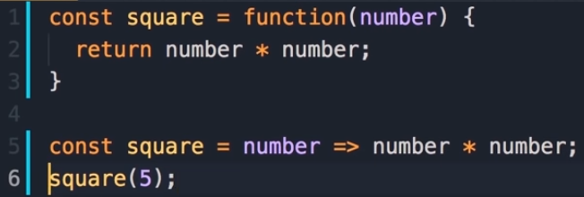

Much shorter to write then a regular function

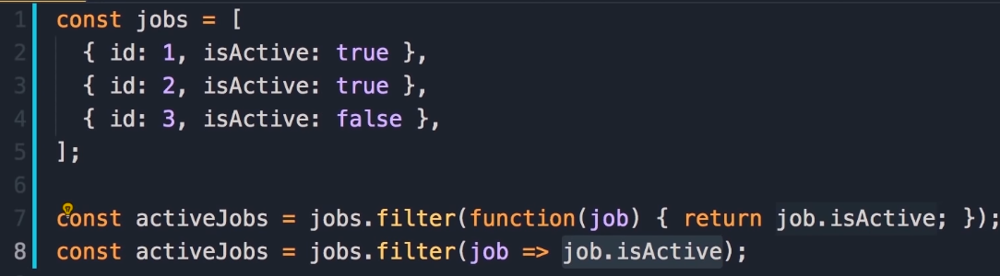

## Arrow Functions and `this`

When using `setTimeout()` it has a standalone function. It will return a reference to a `window` object, not `person` object.
Set `var self = this;` and it should work.

If you use arrow function, this returns a reference to person object

Arrow functions don’t rebind the `this` keyword

## `Array.map()`

Map takes one item at a time in the array and returns a new item.
Can use template coding in ES6.
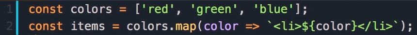

## Object Destructuring

If you want 3 constants set to properties in an object, it’s not efficient to reference object.property; for each case. Object destructuring helps make it more efficient.

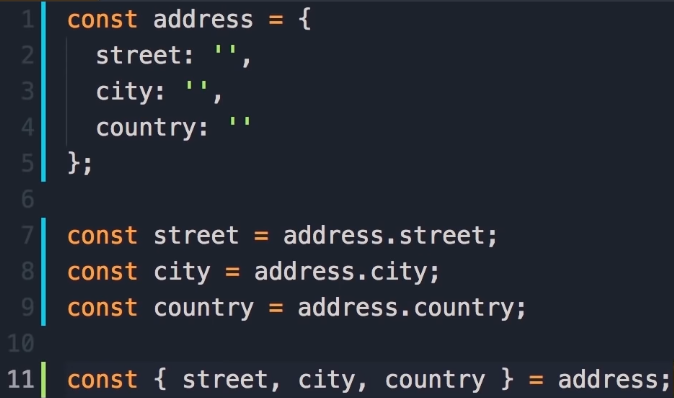

You can also assign a different name to the property, called an alias.

## Spread Operator

If you want to combine two arrays, you can spread the first array and spread the second array.  You can add an element in the middle, at the end etc.

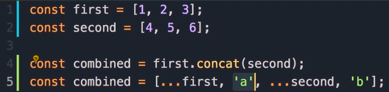

If you want to clone the first array, you can spread the first array.

If you want to combine two objects, you can spread the objects, similarly to arrays.

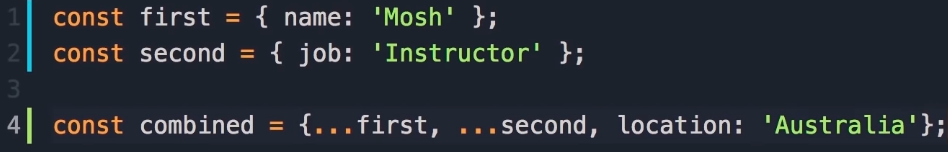

Can clone an object

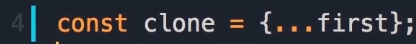

## Classes

When we have multiple objects with the same method, we have to fix it in all objects that use that method. We need a blueprint, so use a class to help solve this issue.

Classes have a `constructor()` and methods. Use `this` in `constructor()`

Need to use the `new` keyword to call a class and assign it to a new object.

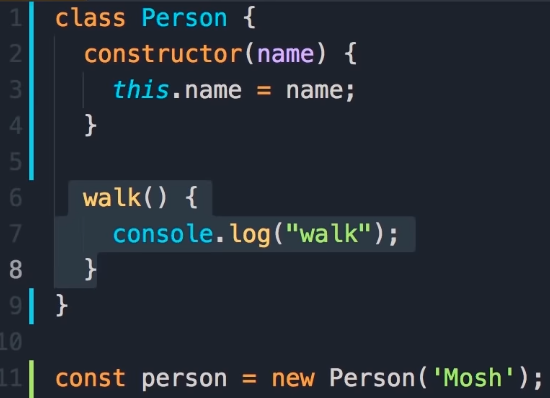

## Inheritance

A class can inherit all properties in another class with `extends`

If you have multiple parameters, and some need to pass to inherited class, use `super()` to pass parameter to inherited class.

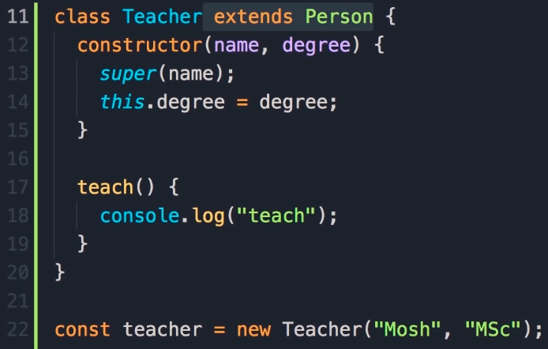

## Modules

Split code across multiple files when there are multiple classes. Dividing to multiple files is called modules.

Need to make classes public by adding `export` to the classes.

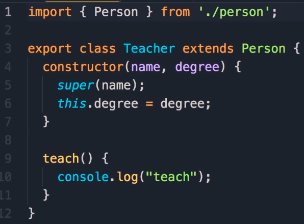

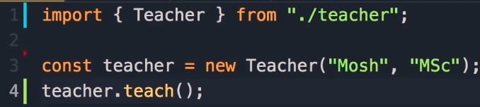

## Named and Default Exports

Can export more than one object from a file. These are named exports. 
The main object exported from a module is a default export. This is usually when there is only one object to export. Add the word `default` to it.
In JavaScript, classes are objects. 

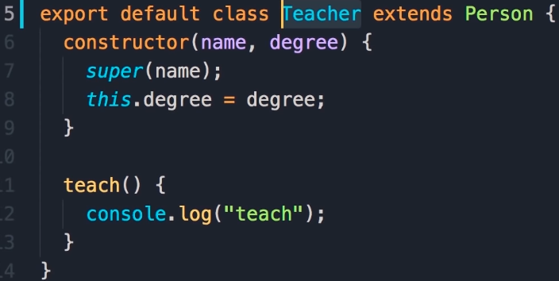

Don’t need curly braces for imports of `default` objects.

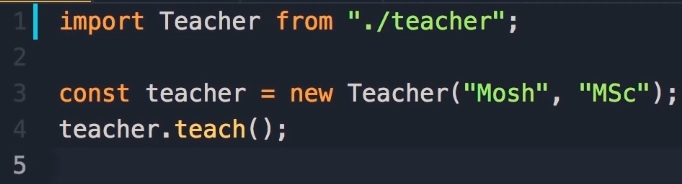

Can also import named objects with the default

