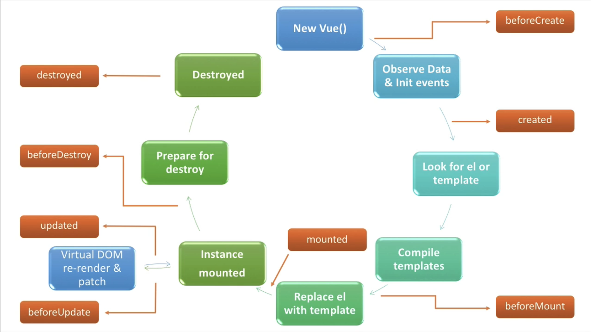
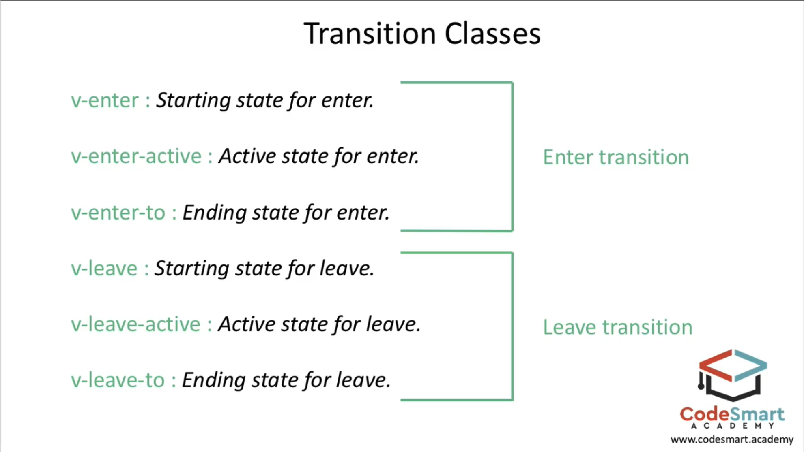

# Vue.js Overview

## Why use Vue.js?

- Approachable
- Already know HTML, CSS and JavaScript? Read the guide and start building things in no time!

Versatile

- An incrementally adoptable ecosystem that scales between a library and a full-featured framework.

Performant

- 20KB min+gzip Runtime
- Blazing Fast Virtual DOM
- Minimal Optimization Efforts 

## Getting started

Can use this for development:

``` html
<!— development version, includes helpful console warnings —>
<script src=“https://cdn.jsdelivr.net/npm/vue/dist/vue.js”></script>
```

Can also build

Production version:

``` html
<!— production version, optimized for size and speed —>
<script src=“https://cdn.jsdelivr.net/npm/vue”></script>
```

Installing on your machine:

``` text
$ npm install -g vue-cli
$ vue init webpack my-project
$ cd my-project
$ npm install
$ npm run dev
```

### Core

HTML

``` html
<div id=“app”>
  {{ message }}
</div>
```

JS

``` javascript
var app = new Vue({
  el: ‘#app',
  data: {
    message: 'H‘llo Vue!'
’ }
})
```

Renders as

``` text
Hello Vue!
```

## Syntax

### For loop

``` html
<ol>
    <li v-for=“todo in todos”>
      {{ todo.text }}
    </li>
  </ol>
```



## Can have these:

``` javascript
new Vue({
  data: { … }
  props: [‘size’],
  props: { size: Number },
  computed: { fullname() { return this.name + ‘ ‘ + this.lastName } },
  methods: { go() { … } },
  watch: { a (val, oldVal) { … } },
  el: ‘#foo',
  template: ‘.’…’  replace: true, // replace element (default true)

  // lifecycle
  created () {},
  beforeCompile () {},
  compiled () {},
  ready () {}, // $el is inserted for the first time
  attached () {},
  detached () {},
  beforeDestroy () {},
  destroyed () {},

  // options
  directives: {},
  elementDirectives: {},
  filters: {},
  components: {},
  transitions: {},
  partials: {}
})
```





